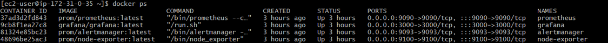
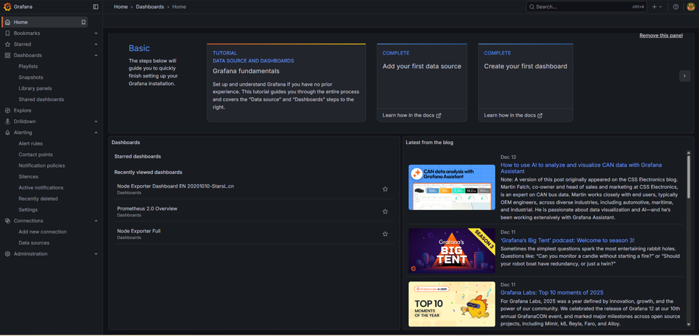
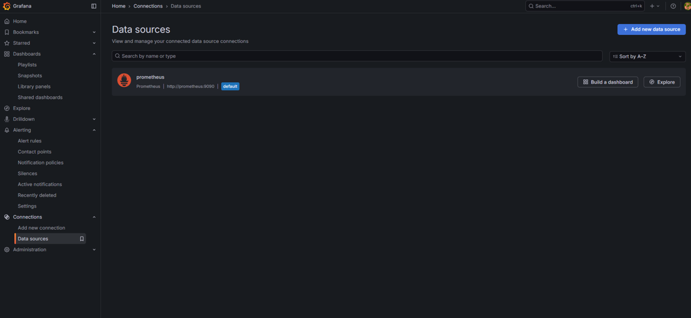
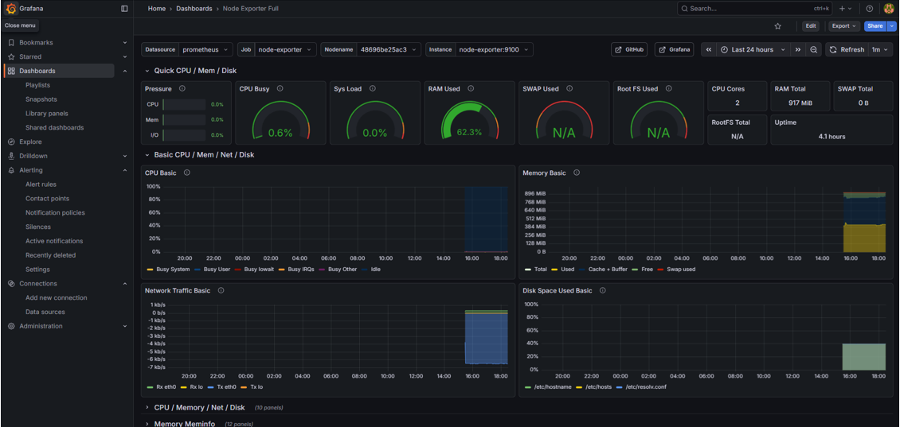
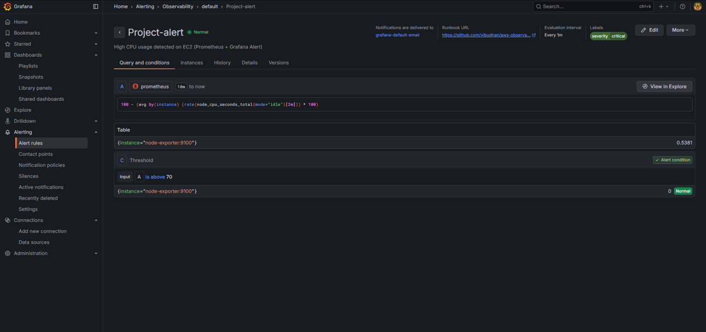
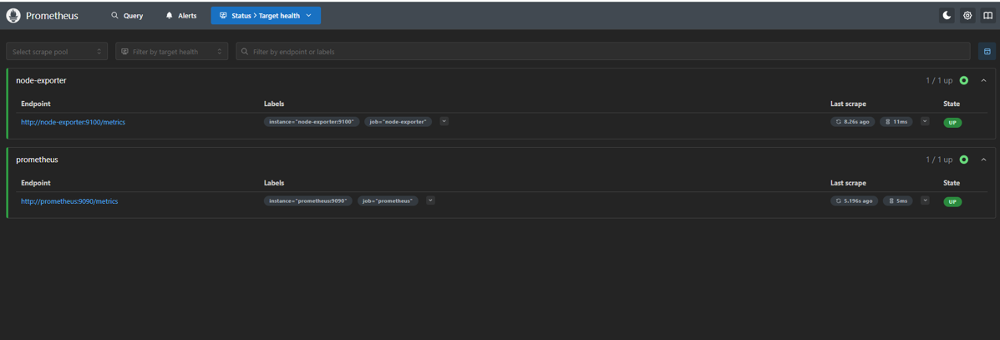

# AWS Observability Stack 🚀 (Prometheus + Grafana)

## 📌 Project Summary
This project demonstrates a complete **Monitoring & Observability setup** deployed on **AWS EC2** using **Docker Compose**.  
It monitors a Linux server in real-time by collecting system metrics using **Node Exporter**, storing them in **Prometheus**, and visualizing them through interactive **Grafana dashboards**.  
I also configured a **Grafana Alert Rule** to detect high CPU usage.

---

## ✅ Tech Used
- **AWS EC2 (Amazon Linux)**
- **Docker + Docker Compose**
- **Prometheus**
- **Node Exporter**
- **Grafana**
- **Alertmanager**

---

## 🎯 What I Implemented
- ✅ Deployed Prometheus + Grafana + Node Exporter + Alertmanager using Docker containers
- ✅ Configured Prometheus scraping to collect EC2 instance metrics
- ✅ Integrated Prometheus datasource with Grafana
- ✅ Imported Grafana dashboards (Node Exporter Full)
- ✅ Created a Grafana alert rule for **High CPU Usage**
- ✅ Verified Prometheus targets are UP and actively scraping metrics

---

## 📸 Output Screenshots

### ✅ 1) Prometheus Targets (UP Status)

### ✅ 2) Grafana Dashboard (Node Exporter Full)

### ✅ 3) Prometheus Metrics Overview

### ✅ 4) Grafana Alert Rule Created

### ✅ 5) Alert / Contact Point Configuration

### ✅ 6) Full Monitoring Stack View

---

## 👤 Author
**Vibudhan Dubey**  
GitHub: https://github.com/vibudhan
